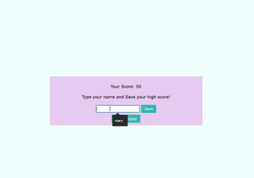

# Code Quiz

A simple web application written with Javascript to test a
programmer on their coding knowledge.

Deployed [here](https://na-br-wo.github.io/code-quiz/)

Uses only basic CSS, Javascript, and HTML.

Click "Start Quiz!" button to begin the quiz.

If you answer a question correctly, the page will display "Correct!"

You can then click "Next" and move on to the next question. You will also score 10 points.

If you answer a question incorrectly, the page will display "Incorrect!" and deduct
10 seconds from your time.

Afterwards, you can save your name along with your score.

